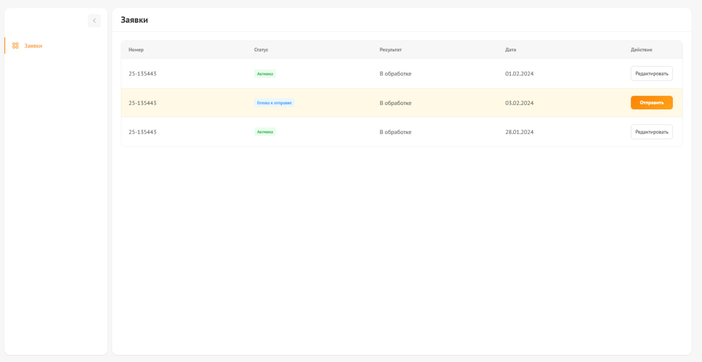

# Nuxt Requests Management

Приложение для управления заявками и редактирования товаров

Деплой: https://nuxt-requests-management-app.vercel.app/


### Главная страница `/`
- Таблица заявок с колонками: Номер, Статус, Результат проверки, Дата создания, Действие
- Динамические кнопки действий:
    - **"Редактировать"** - если нет данных в localStorage
    - **"Отправить"** - если есть несохранённые изменения
- Навигационное меню с возможностью сворачивания

### Страница редактирования `/edit?id=<id>`
- Список товаров с редактируемыми полями:
    - Название (readonly)
    - Количество (input)
    - Цена (input)
    - Цвет (select)
- Валидация при сохранении:
    - Количество и цена: только цифры и точка `^\d+(\.\d+)?$`
    - Цвет: только из списка опций
    - Все поля обязательны
- Сохранение в localStorage
- Кнопка "Назад" для возврата на главную

## Установка и запуск
#### Клонируйте репозиторий:
```bash
git clone https://github.com/Kurennu/nuxt-requests-management-app.git
```
#### Перейдите в директорию проекта:
```bash
npm requests-management
```
#### Установка зависимостей
```bash
npm install
```
#### Запуск в режиме разработки
```bash
npm run dev
```

#### Приложение будет доступно по адресу: `http://localhost:3000`